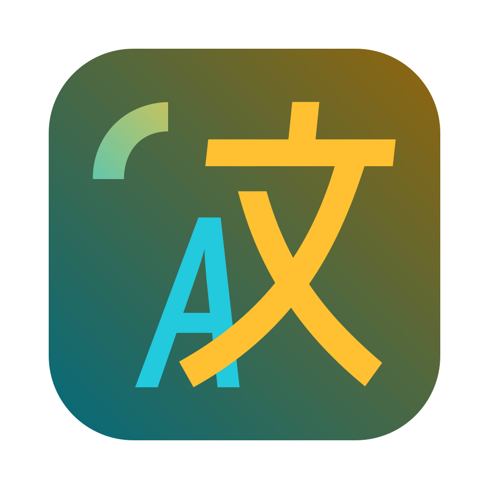

<div align="center">
  
  <h1>pot-guling · 古零</h1>
  <p>划词翻译、截图识别与 AI 追问，在桌面上连成一套工作流。</p>
  <p>基于 Pot 的个人派生版，重点改善 Windows 下的多窗口操作、追问体验与设置管理。</p>
  <p>
    <a href="https://github.com/shen1950/pot-desktop/releases">下载安装</a> ·
    <a href="#快速上手">快速上手</a> ·
    <a href="CHANGELOG">更新记录</a> ·
    <a href="https://github.com/shen1950/pot-desktop/issues">问题反馈</a>
  </p>
  
  
  
</div>

## 这是什么

**pot-guling** 在 [Pot](https://github.com/pot-app/pot-desktop) 的划词翻译、OCR、语音合成、生词本与插件能力上，加入 AI 多轮追问、多窗口翻译和桌面交互改进，由 [shen1950](https://github.com/shen1950) 维护。

GitHub 仓库沿用 `shen1950/pot-desktop` 这个地址，**项目名称是 pot-guling，master 是本项目的主源码分支**。历史开发分支 `dev/guling-ui` 和已有发布标签继续保留；上游 Pot 的源码与贡献历史也保留在 Git 历史中。

当前最近发布版本为 **v1.4.7**。master 还包含尚未发布的项目入口、更新行为和构建流程整理，详见 [CHANGELOG](CHANGELOG)；下载某个版本对应的源码，请使用该 Release 的标签。

## 有哪些能力

| 使用场景                     | pot-guling 的实现                                                          |
| ---------------------------- | -------------------------------------------------------------------------- |
| 选中一段文字，比较多个译法   | 保留多服务并行翻译，可复用现有窗口，也可通过独立快捷键新建翻译窗口         |
| 翻译后继续问背景、语法或概念 | 独立 AI 追问窗口，支持多轮对话、流式输出、编辑消息、重新生成与模型切换     |
| 截图后继续问图里的内容       | OCR 后可发起文字追问；「带图追问」将原图交给支持视觉输入的模型             |
| 翻译和追问用不同模型         | 可单独选择追问服务，支持可用的 OpenAI 兼容服务及符合配置要求的 AI 插件实例 |
| 同时查阅多段内容             | 支持多个翻译窗口及置顶；划词、输入、截图翻译均提供窗口复用与新建入口       |
| 长时间在桌面使用             | 设置页加载就绪后显示，适配文本缩放，记忆窗口尺寸，侧边栏宽度可拖动保存     |
| 管理多个服务配置             | 删除服务前确认，历史记录显示具体服务实例；恢复备份后刷新配置               |
| 从托盘重启应用               | Windows 原生进程交接，等待旧实例退出，兼容含中文、空格和特殊字符的安装路径 |

翻译与 OCR 服务由各自服务商提供，是否需要 API Key、费用及模型能力取决于所选服务。带图追问需要支持图像输入的模型；本项目不提供共享 API Key。

## 下载安装

前往 **[Releases](https://github.com/shen1950/pot-desktop/releases)**，选择需要的版本，下载 `pot-guling_<版本>_x64-setup.exe` 后安装。

-   **已验证平台：Windows x64。** 项目保留上游跨平台代码，macOS、Linux 及其他架构的派生版构建尚未在本次整理中验证。
-   应用标识为 `com.guling.pot`，与上游配置目录隔离。Windows 配置通常位于 `%APPDATA%\com.guling.pot`；实际路径可在「关于应用 → 查看配置」打开。
-   与上游同时运行时，快捷键和本地 HTTP 端口可能冲突。请分别配置；默认端口沿用 `60828`。
-   master 中的更新入口只引导至本仓库 Releases 手动下载，已关闭继承自上游的自动安装更新。**已经安装的历史版本不会因 master 改动而改变行为**；旧版本用户建议在常规设置中关闭自动检查更新，手动从本仓库下载。
-   v1.4.7 曾替换过同版本安装包，是否包含最终重启修复不能只看版本号，可核对 [验证记录及 SHA-256](docs/restart-v1.4.7-verification.md)。

## 快速上手

1. 打开设置，在「服务设置」添加翻译、识别或语音服务，并填写所需配置。
2. 在「热键设置」配置划词翻译、输入翻译、截图翻译的快捷键；按需要选择复用窗口或新建窗口。
3. 在「翻译设置」选择 AI 追问服务。翻译或 OCR 完成后点击追问；需要理解图片时使用带图追问。
4. 通过「关于应用」访问本项目源码、下载页、反馈入口，以及日志和配置目录。

上游的 [服务配置文档](https://pot-app.com/docs/) 和 [插件目录](https://pot-app.com/plugin.html) 仍可供兼容服务参考。它们由上游维护，不是 pot-guling 的项目主页。

## 从源码运行

推荐 Node.js 24、pnpm 11.20.0、Rust stable。Windows 还需 Visual Studio C++ Build Tools、Windows SDK 和 WebView2。NSIS 打包由 Tauri 工具链处理，首次构建可能需要联网下载资源。

```bash
git clone https://github.com/shen1950/pot-desktop.git
cd pot-desktop
git switch master
pnpm install --frozen-lockfile
pnpm dev                         # 仅前端服务器；桌面 API 需要 Tauri
pnpm tauri dev                   # 完整桌面开发模式
pnpm build                       # 前端生产构建
cargo test --manifest-path src-tauri/Cargo.toml --locked --bin pot
pnpm tauri build --bundles nsis -- --locked
```

Windows 安装包位于 `src-tauri/target/release/bundle/nsis/`。Rust 内部 crate 名仍为 `pot`，应用显示名和安装包名为 `pot-guling`。

[开发与发布说明](CONTRIBUTING.md) 介绍分支、版本和构建工作流；[项目结构说明](docs/project.md) 列出功能入口与上游兼容边界。

## 致谢与许可

本项目派生自 [pot-app/pot-desktop](https://github.com/pot-app/pot-desktop)，感谢 Pylogmon、Pot 贡献者、翻译维护者，以及 [zeta987/pot-desktop](https://github.com/zeta987/pot-desktop) 的 AI 追问实现参考。

项目沿用 **GPL-3.0**，完整条款见 [LICENSE](LICENSE)。原有作者、版权声明、许可证和 Git 提交归属保留。pot-guling 的新增功能和发布由本项目维护，不代表上游 Pot 的发布或支持承诺。
